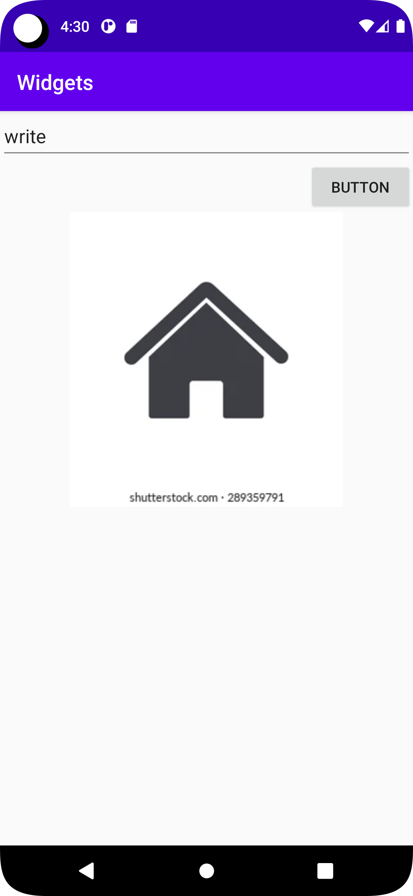

# Rapport
LinearLayout har valts i projekten med vertikal ordning, match_parent användes som en layoutparameter för att ange att layouten ska matcha storleken på dess överordnade behållare. 
Detta innebär att layouten kommer att ta upp hela det tillgängliga utrymmet i sin överordnade behållare i både bredd och höjd. 
Till exempel, editText layout_width
```
<EditText
android:layout_width="match_parent"
android:text="write" />
```
wrap_content användes som en layoutparameter för att specificera att layouten ska omsluta innehållet tätt.
Det betyder att layouten kommer att anpassa sin storlek för att passa storleken på innehållet,
Om man till exempel ställer in bredden eller höjden, kommer den att anpassa storleken
för att passa bredden eller höjden på innehållet.
```
<Button
android:layout_height="wrap_content"
android:layout_gravity="right"
android:text="Button" />
```
3 olika widget har implementerades i uppgiften. ImageView, Button och Edittext.
Koden visade error pga att storleken på EditText var liten, då lagts in storleken manuellt i textedit widget.
```
android:minHeight="48dp"
```
ImageView widget, bilden placerades i mitten med hjölp av gravity layouten och sen centerades genom att markera "true"
```
android:layout_gravity="center"
```
Button widget har marginal till längst till höger, detta användes gravity layout och i parameter skrevs "right"
för att palacera knappen tilhöger
```
android:layout_gravity="right"
```


## Koden:

```
android:orientation="vertical"
   
```
```
<EditText
        android:layout_width="match_parent"
        android:layout_height="wrap_content"
        android:minHeight="48dp"
        android:text="write" />
   
```
```
 <Button
        android:id="@+id/button"
        android:layout_width="100dp"
        android:layout_height="wrap_content"
        android:layout_gravity="right"
        android:text="Button" />
  
```
```
<ImageView
        android:layout_width="wrap_content"
        android:layout_height="wrap_content"
        android:layout_gravity="center"
        app:srcCompat="@drawable/home_icon_260nw_289359791" />
   
```

# Bilden 




